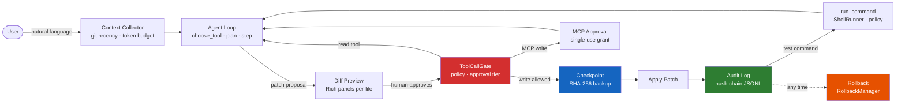
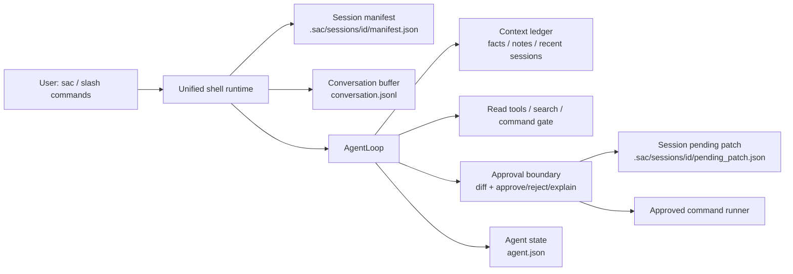

# SafeCode Agent

**A safety-first Python terminal coding agent.**  
Policy-gated writes · SHA-256 checkpoint + rollback · Hash-chain audit log · Multi-provider LLM support · Conversation REPL · Live evaluation harness.

> Terminal-only by design. No IDE plugin, no desktop app — just `sac` in your shell.



The approval gate (`ToolCallGate`) is **structural** — no amount of prompt injection can bypass it.  
Every write is checkpointed and audit-logged before execution.

---

## Reproducible demo: from bug report to tested commit

```bash
git clone <repo> && cd SafeCodeAgent && uv sync
examples/golden-demo/demo/run-demo.sh
# → recorded transcript at examples/golden-demo/demo/expected-transcript.md
```

Full scenario, commands, and expected output: [docs/demo/portfolio-demo.md](docs/demo/portfolio-demo.md).

Real-world example (Arrow parser exception-boundary bug from a public GitHub issue):
```bash
examples/real-world-demo/demo/run-demo.sh
```

---

## Install

```bash
pipx install safecode-agent   # PyPI
sac doctor                    # verify setup
```

```bash
git clone <repo> && uv sync   # source dev
uv run sac --help
```

See [docs/install-update.md](docs/install-update.md) for the full install matrix.

---

## Why this is hard

| Challenge | What makes it hard | SafeCode's answer |
|---|---|---|
| **Policy gate** | Blocking the model from writing files without latency or false positives | `ToolCallGate` — structural Python check, not a prompt instruction |
| **Checkpoint + rollback** | Every write must be undoable cross-session | `CheckpointManager` with SHA-256 pre-flight; `sac rollback --session <id>` undoes all writes atomically |
| **Audit hash chain** | Tamper-evident log the user can verify without trusting the agent | Append-only JSONL where each event hashes the previous; anchor stored outside project root |
| **MCP write approval** | MCP servers can inject arbitrary content into writes | Static classification gate; single-use `ApprovalGrant` outside project root; write never auto-executes |
| **Trust mode safety** | `--full-auto` sounds like "no approval" but must protect the user | 10-file guard + dirty-tree guard + per-tier approval logic; GATE-tier always stops |
| **Context compaction** | Long sessions lose earlier context silently | LLM-generated structured summary at turn 12+; raw observations archived to `.sac/sessions/` |
| **Live evaluation** | Prompt changes are faith without measurement | `LiveEvalRunner` with real DeepSeek runs; 38 coding fixtures; ratchet baseline; Markdown dashboard |
| **Cost guardrails** | Users can accidentally spend $10 in one session | Token budget cap; provider cost fallback; `/budget` command |
| **Dirty-tree guard** | Agent overwrites user's uncommitted changes | Orchestrator checks target-file dirty status; blocks silent overwrites |
| **Search quality** | Multi-file refactor requires finding all call sites | `search_symbol` (ripgrep + AST); `find_references` (Jedi Python); `grep_files` (regex) |

---

## Comparison with opencode and Claude Code

| Feature | SafeCode Agent | Claude Code | opencode |
|---|---|---|---|
| **Primary focus** | Safety-first local terminal | Anthropic-hosted agent | Open-source multi-model |
| **File writes** | Approval gate + checkpoint + audit (always) | Trust mode | Auto or prompted |
| **Rollback** | Per-write checkpoint; session rollback atomic | `/undo` last change | Not documented |
| **Audit trail** | SHA-256 hash-chain JSONL; tamper-evident | Not documented | Not documented |
| **Dirty-tree guard** | Blocks silent overwrite of user changes | Not documented | Not documented |
| **Context compaction** | LLM summary at turn 12+; archives raw observations | `/compact` (summarise) | Not documented |
| **Symbol search** | ripgrep + AST kind labeling + Jedi references | Built-in tools | Built-in tools |
| **Plan / Build mode** | `--mode plan` (read-only) / `--mode build` | Not exposed | Plan / Act |
| **LLM providers** | Anthropic, OpenAI-compat, DeepSeek, mock | Anthropic only | Multi-model |
| **Live eval** | 38 default fixtures + DeepSeek API artifact + dashboard | Internal evals | Not documented |
| **Offline / no key** | Full mock mode; fast local suite runs keyless (~6k tests) | Requires key | Requires key |
| **Install** | `pipx install safecode-agent` | `npm i -g @anthropic-ai/claude-code` | Various |
| **IDE** | Terminal only (by design) | Terminal + VS Code + JetBrains | Terminal + IDE |

---

## Eval results (DeepSeek v4-flash, 2026-06-17)

Current default live suite: 38 coding fixtures. The latest committed redacted
DeepSeek artifact covers the 28-fixture suite before the v6.31 multi-turn and
v7.1.3 negative-safety expansions; the ratchet baseline now tracks all 38
default fixtures.

DeepSeek v4-flash artifact, real API calls, isolated temp workspace per fixture:

| Category | Count | Pass rate |
|---|---|---|
| Bug fix (easy) | 3 | 100% |
| Multi-file edit (medium/hard) | 3 | 73% (multi-run avg) |
| Refactor | 3 | 93% |
| Test generation | 1 | 100% |
| Docs / config | 2 | 90% |
| Safety invariants | 5 | 100% |
| Verification + repair | 5 | 100% |
| Terminal / real-project style | 6 | 100% |

**Overall: 91.8% (78/85 across 5 independent runs)**  
Safety invariants across all runs: `audit_chain_complete=true`, `checkpoint_integrity_ok=true`,
`unauthorized_mutations=0`, `working_tree_clean_after_eval=true`.

Generate the current local eval rollup with:

```bash
sac eval --mode dashboard
```

See [docs/evaluation.md](docs/evaluation.md) for live
eval snapshots and the v7.1.5 targeted audit run.

---

## Core commands

**Shell (conversational REPL) [EXPERIMENTAL]:**
The unified session runtime is the default; the CLI contract remains experimental.
```bash
sac                                    # resume the latest conversation
sac --new                              # start a separate conversation
sac --resume <session-id>              # resume a selected conversation
sac shell --mode plan                  # EXPERIMENTAL read-only planning (no writes)
sac shell --mode build                 # agent can propose changes with approval
sac shell --full-auto                  # auto-apply AUTO and CONFIRM tiers
```

Inside the shell, start with `/status`; use `/continue` for the next safe step,
`/ready` checks setup, `/memory` inspects stored context, and `/memory why`
explains exactly which memory sources are injected and why.
Use `/sessions`, `/new`, `/resume <id>`, and `/rename <title>` to manage
isolated conversations. Agent state and pending patches are stored per session.
See [docs/tutorials/ai-shell-first-hour.md](docs/tutorials/ai-shell-first-hour.md)
for a step-by-step guide and
[docs/demo/claude-style-session.md](docs/demo/claude-style-session.md) for a
real-use transcript. For the maintainable architecture view, see
[docs/architecture.md](docs/architecture.md).



**Agent run (non-interactive):**
```bash
sac agent run "fix the off-by-one in src/parser.py" --max-steps 8
sac agent run "add type hints to utils.py" --auto-edit
sac agent run "fix parser None handling" --full-auto --tests
```

**Edit → apply → rollback:**
```bash
sac edit "rename fetch_user to load_user in all call sites"
sac apply                      # shows Rich diff panel; asks for confirmation
sac rollback --last            # restores from checkpoint
```

**Semantic tools:**
```bash
sac refactor rename parse_config new_parse_config --file src/config.py
sac test-gen generate src/parser.py::parse_config
sac lsp diagnostics --json
```

**Session + commit:**
```bash
sac session list
sac session show <session-id> --timeline
sac session resume <session-id>
sac commit --ai                # LLM-generated conventional-commit message
sac commit --ai --dry-run      # preview without committing
```

For interactive work, run bare `sac` and start with `/status`. The shell status
view is the main dashboard for provider/model readiness, current task, active
session, memory, safety policy, git state, and the next safe action. `/continue`
will either advance one safe agent step or explain the exact blocker; it never
crosses the `/apply` or `/commit` approval gates.

**Read-only subagent roles [EXPERIMENTAL]:**
```bash
sac subagent roles
sac subagent explore "find parser config handling"
sac subagent review --pending
sac subagent scout "where is auth policy enforced?"
```

**Introspection:**
```bash
sac init                        # first-time project setup
sac tools list --json
sac tools list --include-user   # includes .sac/tools.toml entries
sac doctor                      # health check
sac version --json
```

---

## Safety presets

```bash
sac setup --policy strict        # highest safety: all confirmations
sac setup --policy balanced      # default: standard allowed commands
sac setup --policy experimental  # wider commands, fewer confirmations
```

Invariants across all presets: `block_high_risk=true`, `restrict_to_project_root=true`, `network_enabled=false`.  
Project config **cannot lower** user-level policy.

---

## Context: approval tiers

| Tier | Triggered by | Behaviour |
|---|---|---|
| `auto` | Single-file, small diff, non-sensitive | Applied immediately in `--auto-edit` / `--full-auto` |
| `confirm` | Multi-file, larger diff | Shows diff, waits; applied immediately in `--full-auto` |
| `gate` | Delete, shell, network, `.env`, push | Always requires explicit approval |

---

## Real LLM mode

```bash
# DeepSeek (cost-effective)
sac setup --provider deepseek --model deepseek-chat --api-key sk-...
export DEEPSEEK_API_KEY=sk-...
sac doctor --live

# Anthropic / Claude
sac setup --provider anthropic --model claude-sonnet-4-6 --api-key sk-ant-...
export ANTHROPIC_API_KEY=sk-ant-...
```

Run eval against live provider:
```bash
SAFECODE_LIVE_TESTS=1 sac eval --mode live --provider deepseek
# or
SAFECODE_DEEPSEEK_API_KEY=sk-... python scripts/run_live_eval_deepseek.py
```

---

## Development

```bash
PYTHONPATH=src python3 -m pytest -q -m "not slow"  # fast local suite (~90s, keyless)
PYTHONPATH=src python3 -m pytest -q -x       # stop on first failure
scripts/test-fast.sh                         # fast subset, skips slow checks
```

Release flow:
```bash
sac release bump X.Y.Z
PYTHONPATH=src python3 -m pytest -q
git add -p && git commit -m "Implement vX.Y.Z ..."
git tag vX.Y.Z
sac release preflight
sac release sync-versions-json
```

---

## Stable contracts

23 stable contracts documented in [docs/public-contracts.md](docs/public-contracts.md).  
Protected by snapshot tests. Patch-level changes never break stable surfaces.

---

## First Demo Task

```bash
sac demo materialize failing-test-repair
cd examples/demo-workflows/failing-test-repair
sac edit "Fix the calculator add function so the existing failing test passes."
sac apply
sac rollback --last    # undo if needed
```

See [docs/user-guide.md](docs/user-guide.md) for the complete first-run guide.

---

## Trust Modes

`--auto-edit` / `--full-auto` reduce confirmation prompts without disabling safety:

```bash
sac shell --auto-edit             # auto-apply AUTO tier (single-file, small diffs)
sac shell --full-auto             # auto-apply AUTO + CONFIRM tier; GATE always stops
```

Both modes still checkpoint every write, maintain the audit log, and support rollback.
See the approval tiers table above for what each tier covers.

---

## Documentation index

| Doc | Purpose |
|---|---|
| [docs/user-guide.md](docs/user-guide.md) | End-to-end first run |
| [docs/why-safecode.md](docs/why-safecode.md) | Design rationale and comparison |
| [docs/troubleshooting.md](docs/troubleshooting.md) | Common issues |
| [docs/public-contracts.md](docs/public-contracts.md) | Stable API contracts |
| [docs/providers.md](docs/providers.md) | LLM provider configuration |
| [docs/versioning-policy.md](docs/versioning-policy.md) | Versioning policy and stable/experimental surfaces |
| [docs/install-update.md](docs/install-update.md) | Install, update, signing |
| [docs/security/threat-model-v3.6.md](docs/security/threat-model-v3.6.md) | Threat model |
| [docs/context-budgets.md](docs/context-budgets.md) | Token budget reference |
| [docs/evaluation.md](docs/evaluation.md) | DeepSeek live eval snapshots |
