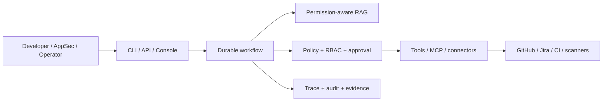

# SafeCodeAgent Enterprise

SafeCodeAgent Enterprise is a governed enterprise security engineering agent platform for
PR review, vulnerability remediation, secure implementation planning, evidence
export, and approval-gated tool use.

It extends the SafeCodeAgent safety kernel—policy-gated writes,
checkpoint/rollback, hash-chain audit, sandbox gates, and redaction—with typed
enterprise workflows, permission-aware RAG, RBAC, human approval, connectors,
observability, and deterministic evaluation. Mutating workflows remain
recoverable through checkpoints, rollback, or audited compensation.

> **Release status:** `v3.0` candidate. Product development and the portfolio
> track are complete; GA still requires independent security sign-off,
> production-like deployment evidence, and a stable live-provider run. See
> [external gates](enterprise-docs/security/external-gates.md) and
> [live progress](.agents/context/progress.json).

## Capabilities

- **PR security review** — collect PR evidence, retrieve cited policy and code,
  assess risk, and gate network writes.
- **Vulnerability remediation** — normalize findings, propose and validate
  patches, and require scoped grants before mutation.
- **Secure planning** — ground implementation plans in tickets, repository
  context, policy, and approved memory.
- **Evidence export** — build redacted, integrity-checked compliance bundles.
- **Team operation** — optional FastAPI/PostgreSQL worker backend, OIDC, live
  GitHub/Jira integration, and an operator console.

The central invariant is simple: **model output is never execution authority.**

## Quickstart

From a clean checkout, no provider key is required:

```bash
uv sync
uv run sac demo --list
uv run sac demo pr-review --offline
```

Without `uv`:

```bash
pip install -e ".[dev,enterprise]"
PYTHONPATH=src sac demo pr-review --offline
```

The offline demo runs in a disposable workspace by default. A deterministic
transcript is available at
[examples/enterprise/demos/v3.2/transcripts/pr-review.txt](examples/enterprise/demos/v3.2/transcripts/pr-review.txt).

## Learning and interview

For portfolio walkthroughs and technical interviews, you do not need GA
sign-off, live model providers, or production deployment evidence. The
offline demo and optional Docker stack are enough.

### Offline demo (fastest)

```bash
pip install -e ".[dev,enterprise]"
PYTHONPATH=src sac demo pr-review --offline
```

Fifteen-minute narrative:
[product-planning/case-study-secure-change-platform.md](product-planning/case-study-secure-change-platform.md).

**Suggested code reading order** (module docstrings are in Chinese throughout
``src/safecode/enterprise/``):

1. `src/safecode/enterprise/workflow/orchestrator.py` — workflow engine
2. `src/safecode/enterprise/rag/retriever.py` — permission-aware RAG
3. `src/safecode/enterprise/approvals/store.py` — grants and single-use consumption
4. `src/safecode/enterprise/policy/resolver.py` — policy precedence
5. `src/safecode/enterprise/api/routes/runs.py` + `worker/commands.py` — Team Server
6. `src/safecode/enterprise/evidence/export.py` — audit bundles

### Docker full stack (API + worker + PostgreSQL + console)

Requires Docker Compose v2. Uses disposable development credentials only.

```bash
bash scripts/enterprise-dev-up.sh
```

The script copies `compose/enterprise.dev.env.example` when needed, prepares
local OIDC signing material, starts
[compose.enterprise.yaml](compose.enterprise.yaml), and prints a bearer token for
the console login page.

- API: http://127.0.0.1:8080
- Console: http://127.0.0.1:3000
- Tenant: `tenant-dev`

Stop the stack:

```bash
docker compose -f compose.enterprise.yaml down -v
```

`scripts/enterprise-up.sh` is for production-like startup and refuses the
committed development credentials. Use `enterprise-dev-up.sh` for learning and
interviews.

## System Map



## Documentation

| Need | Document |
|---|---|
| Concise architecture | [enterprise-docs/architecture.md](enterprise-docs/architecture.md) |
| Detailed platform architecture | [enterprise-docs/platform-architecture-v2.md](enterprise-docs/platform-architecture-v2.md) |
| Business and workflow design | [enterprise-docs/workflow-design.md](enterprise-docs/workflow-design.md) |
| Data contracts | [enterprise-docs/data-models.md](enterprise-docs/data-models.md) |
| Security governance | [enterprise-docs/security-governance-plan.md](enterprise-docs/security-governance-plan.md) |
| Deployment | [enterprise-docs/deployment-profiles.md](enterprise-docs/deployment-profiles.md) |
| Current security review | [enterprise-docs/security/security-review-v3.0.md](enterprise-docs/security/security-review-v3.0.md) |
| Architecture decisions | [product-planning/decision-log.md](product-planning/decision-log.md) |
| End-to-end case study | [product-planning/case-study-secure-change-platform.md](product-planning/case-study-secure-change-platform.md) |
| Final project notes | [product-planning/README.md](product-planning/README.md) |

Historical version plans and execution backlogs are intentionally left to Git
history. They were useful while building the product but are not current
documentation.

## Verification

```bash
uv run --extra enterprise python -m pytest -q tests/enterprise
uv run --extra enterprise python -m pytest -q
```

Optional PostgreSQL and live-provider lanes require operator-owned environment
configuration and are skipped by default.

## Development

```bash
uv run sac --help
uv run sac enterprise --help
```

Repository governance is defined in [AGENTS.md](AGENTS.md). Candidate release
details are in [RELEASE-NOTES-v3.0.0.md](RELEASE-NOTES-v3.0.0.md).
