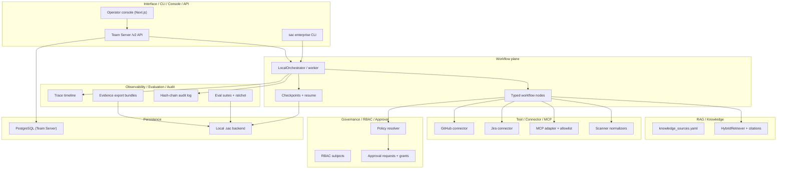

# SafeCodeAgent Enterprise Architecture Poster

This poster summarizes the **implemented** enterprise platform as of the `v3.0`
candidate. It is a portfolio review aid. It does not claim enterprise GA
approval; external gates G1/G2/G3 remain pending (see
`enterprise-docs/security/external-gates.md`).

Normative target architecture: `enterprise-docs/platform-architecture-v2.md`.

---

## System Overview



---

## Planes and Primary Modules

| Plane | Role | Primary code |
|-------|------|--------------|
| Interface / CLI / Console / API | Human and automation entry points | `src/safecode/enterprise/cli/`, `src/safecode/cli_enterprise.py`, `src/safecode/enterprise/api/`, `console/` |
| Workflow | Deterministic orchestration, interrupts, resume | `src/safecode/enterprise/workflow/` |
| RAG / Knowledge | Permission-aware retrieval and citations | `src/safecode/enterprise/rag/` |
| Tool / Connector / MCP | Classified external capabilities | `src/safecode/enterprise/connectors/`, `src/safecode/enterprise/tools/` |
| Governance / RBAC / Approval | Policy gates and human authority | `src/safecode/enterprise/policy/`, `src/safecode/enterprise/rbac/`, `src/safecode/enterprise/approvals/` |
| Persistence | Durable runs, approvals, audit | `src/safecode/enterprise/persistence/` |
| Observability / Evaluation / Audit | Trace, eval ratchet, standalone evidence export | `src/safecode/enterprise/trace/`, `src/safecode/enterprise/eval/`, `src/safecode/enterprise/audit/`, `src/safecode/enterprise/evidence/` |

---

## Trust Boundaries

1. **Model proposals ≠ execution authority.** Workflow nodes emit proposals;
   policy and approvals gate writes, connector calls, and MCP operations.
2. **Retrieved content is untrusted input.** RAG preserves source identity;
   prompt-injection cases are in eval suites.
3. **Tenant and RBAC boundaries** apply to API, persistence, and trace export.
4. **Audit is append-only** with hash-chain verification before standalone
   evidence export.
5. **Console safety display is truthful:** timeline safety invariants render as
   `not verified` unless the API supplies explicit proof.

---

## Offline Portfolio Demo Path

```text
sac demo pr-review --offline
  → examples/enterprise/fixtures/pr_sql_injection/
  → temporary workspace (default; no persistent repo-root .sac mutation)
  → workflow nodes + citations + approval refusal
  → transcript snapshot examples/enterprise/demos/v3.2/transcripts/pr-review.txt
```

---

## Status (Honest)

| Track | State |
|-------|-------|
| Enterprise product (`v3.0`) | Candidate; **blocked** on external GA gates |
| Portfolio track (`v3.1`–`v3.4`) | Presentation and reproducibility; not GA evidence |
| Live providers / production | Optional lanes; operator-owned evidence required for GA |

Live status: `.agents/context/progress.json`.
