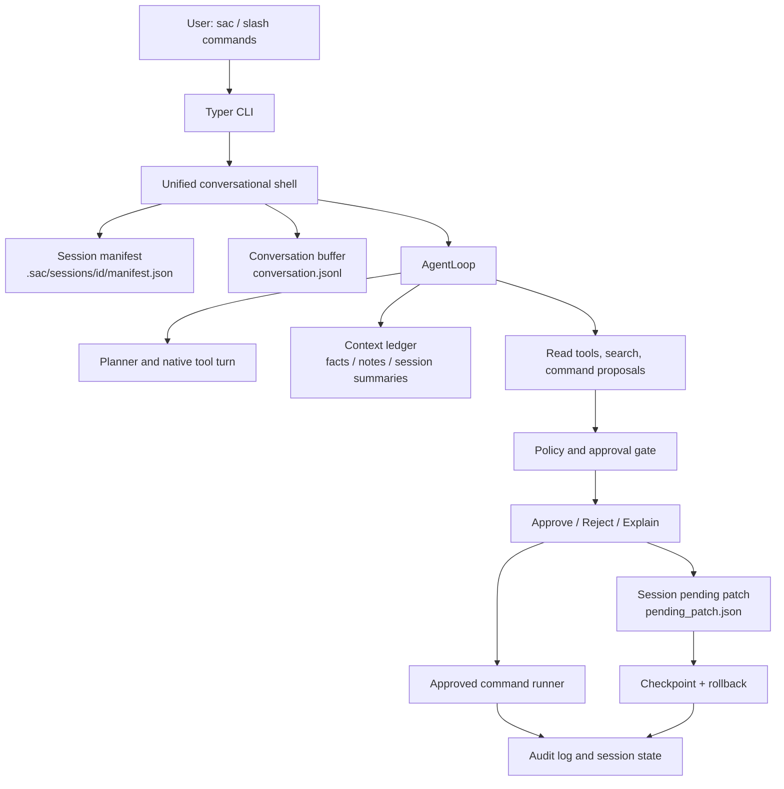

# SafeCode Agent Architecture

SafeCode Agent is a terminal coding agent designed around one invariant:
model output is never trusted as an execution authority. The LLM can propose,
read, summarize, and request tools, but writes, commands, networked operations,
and release actions pass through deterministic policy gates.

## System Shape

## Safety Boundaries

The central safety boundary is structural, not prompt-based:

- The model cannot directly write files.
- Patch proposals are saved as pending state before application.
- Commands are converted into pending actions before execution.
- Approval state is stored per conversation, not globally.
- Checkpoints and rollback are created before approved writes.
- Secrets are redacted from context and tests disable real keychain writes.

This is why SafeCode can use real providers while keeping mutation authority in
local code.

## Session Kernel

Bare `sac` enters the unified shell runtime. Each conversation owns:

- `.sac/sessions/<id>/manifest.json`
- `.sac/sessions/<id>/conversation.jsonl`
- `.sac/sessions/<id>/agent.json`
- `.sac/sessions/<id>/pending_patch.json` when a patch is awaiting approval

The shell resumes the latest conversation by default, supports `/new`,
`/sessions`, `/resume <id>`, `/rename <title>`, and preserves interrupted
sessions after Ctrl-C. Legacy global pending patches are adopted into the active
conversation so older `sac edit/apply` flows do not collide with the new shell.

## Memory Ledger

Context injection is handled by a typed context ledger. It separates:

- approved facts
- project notes
- recent session summaries
- workspace observations
- pending facts that require review

`/memory why` explains exactly what is injected and what is withheld. This keeps
the memory system learnable: users can inspect the source and policy behind the
agent's context.

## Provider And Credentials

Provider profiles live in user configuration, while API keys should live in a
credential backend. `--store keychain` writes to the system keychain when
available, including a macOS `security` CLI fallback when the Python `keyring`
package is absent. If keychain storage fails, the command fails closed instead
of silently writing the key into config.

## Testing Strategy

The test suite is layered:

- Unit and contract tests protect policy gates, patch parsing, rollback, memory,
  CLI JSON envelopes, and provider profile behavior.
- Shell runtime tests protect the Claude-style conversation path, session
  isolation, approval handling, interruption, and keychain behavior.
- Eval fixtures and live-provider smoke tests are opt-in and separate from the
  fast local suite.
- Packaging checks verify that source files, docs, sdist, and wheel contents are
  ready for distribution.

Current local evidence for this architecture includes:

- `scripts/test-fast.sh`
- `python3 scripts/check-doc-links.py`
- `python3 scripts/verify-package.py`
- a real DeepSeek read-only shell smoke using `deepseek-v4-flash`

## Interview Summary

SafeCode Agent is a security-first coding agent with a real conversational CLI,
session-scoped approval state, auditable writes, rollback, provider/keychain
management, and explainable memory. The interesting engineering work is the
separation between model intent and local authority: the LLM suggests actions,
but deterministic code decides what can execute.
