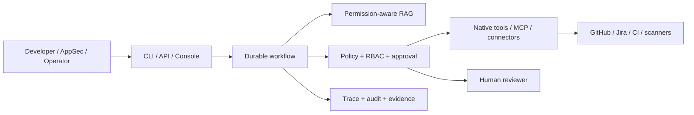
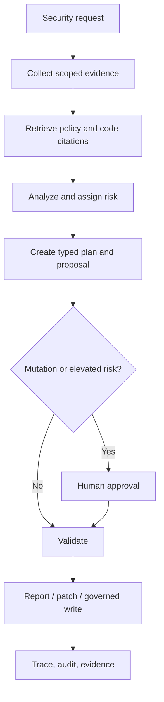

# SafeCodeAgent Enterprise Architecture

SafeCodeAgent Enterprise is a governed secure-change platform for PR security
review, vulnerability remediation, secure implementation planning, and
compliance evidence. It supports a deterministic local mode and an optional
Team Server without weakening the local safety kernel.

## Core Planes

1. **Interface** — CLI for local operation; `/v2` API and console for teams.
2. **Workflow** — typed, resumable nodes with persisted checkpoints.
3. **Retrieval** — tenant- and permission-scoped sources with citations.
4. **Governance** — policy precedence, RBAC, approval grants, and redaction.
5. **Integration** — classified tools and connectors behind deterministic gates.
6. **Persistence** — local filesystem backend or PostgreSQL Team Server backend.
7. **Evidence** — append-only audit, traces, validation, and export bundles.

## Non-Negotiable Boundaries

- Model output is a proposal, never execution authority.
- Unknown tools, actions, and network access are denied by default.
- Mutating actions require deterministic policy checks and scoped approval.
- Approval grants bind tenant, action, policy snapshot, and proposal digest.
- Retrieved and external content is untrusted and permission filtered.
- Secrets are redacted before model use, persistence, logging, or export.
- File-writing workflows preserve rollback or an audited compensating action.
- Local and Team Server backends implement the same public safety contracts.

## Main Business Flow

Detailed plane ownership and local/server boundaries are in
`platform-architecture-v2.md`; workflow branches are in `workflow-design.md`.
