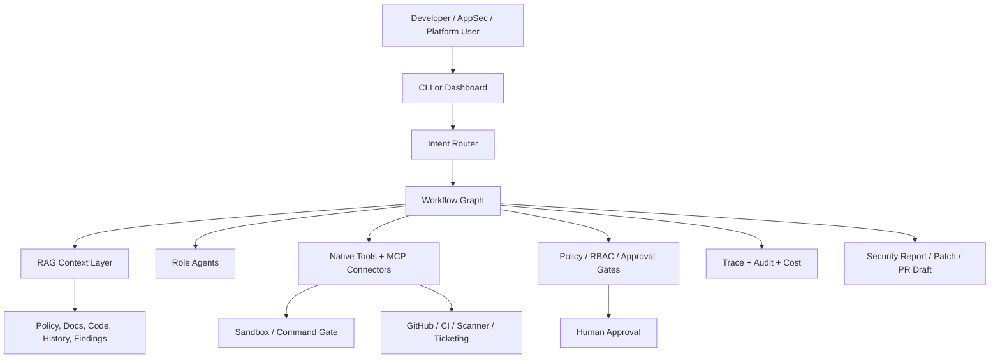

# Enterprise Architecture

**Implementation status (v1.9):** Executable contracts through v1.9 are implemented; see `.agents/context/progress.json` for live stage state.
## Target Shape

SafeCodeAgent Enterprise should use the existing SafeCodeAgent safety kernel as
the local execution boundary and add enterprise workflow services around it.

## Main Layers

1. Interface layer: CLI first, dashboard later.
2. Workflow layer: LangGraph-compatible state machines for enterprise tasks.
3. Agent layer: typed role agents with clear inputs and outputs.
4. Retrieval layer: permission-aware RAG over policy, code, docs, history, and
   scanner findings.
5. Tool layer: native SafeCode tools plus MCP connectors.
6. Governance layer: policy, RBAC, approval tiers, sandbox, redaction, and audit.
7. Observability layer: traces, run timelines, eval artifacts, cost, and failure
   taxonomy.

## Core Workflow

1. Classify the request: PR review, vulnerability remediation, secure planning,
   incident analysis, or compliance evidence.
2. Build scoped context: repo metadata, changed files, relevant symbols, policy
   docs, historical fixes, scanner findings, and user-provided constraints.
3. Retrieve and cite evidence.
4. Produce a structured plan with risk tier and required approvals.
5. Execute read-only tools automatically when allowed.
6. Pause for human approval before writes, high-risk commands, network writes,
   branch pushes, PR creation, or scanner actions that cross policy boundaries.
7. Validate with tests, scanners, or configured project commands.
8. Produce report, patch, or PR draft with trace and audit references.

## State Model

Each enterprise run should persist:
- run id, actor, organization/project/repo ids
- task type and original request
- policy context and permission snapshot
- selected files and retrieval citations
- agent plan and node outputs
- tool calls and redacted observations
- approvals, rejections, and reviewer comments
- validation commands and results
- cost, token, latency, and failure metadata
- final report and optional patch/PR references

## Architectural Rules

- Workflow nodes call tools through policy-aware adapters, not directly.
- Tool outputs are untrusted and redacted before model context.
- Retrieval citations must preserve source identity and permission verdict.
- Agent role handoffs use typed models, not free-form strings.
- Every mutating path has a preview, approval state, audit event, and rollback
  or compensating action story.
