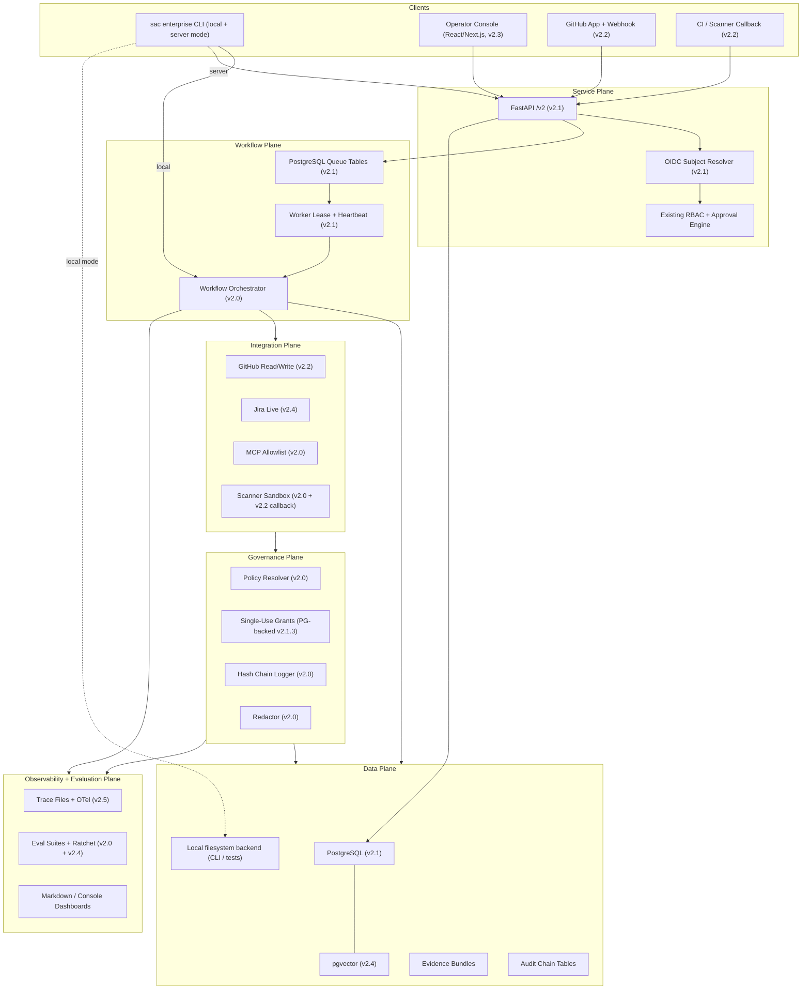
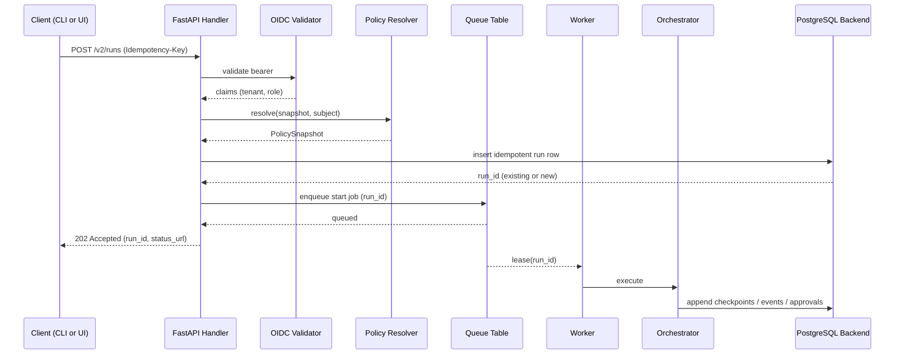
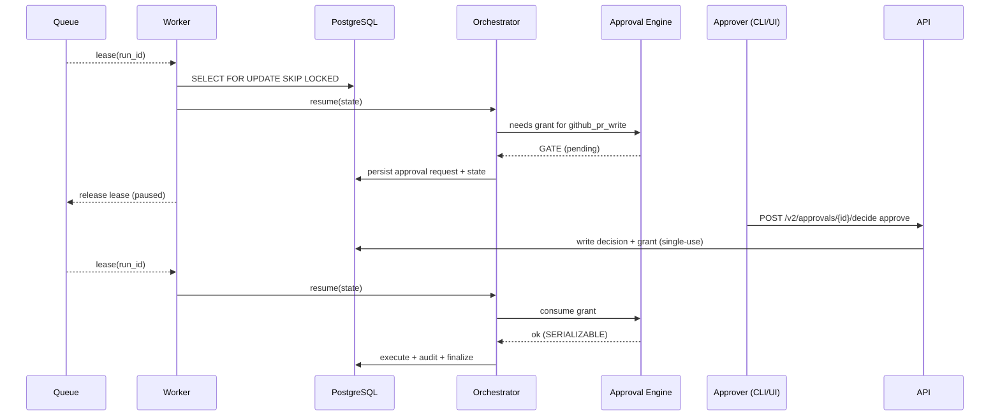

# Platform Architecture v2 (Post-RC Target)

- **Owner:** SafeCodeAgent Enterprise platform group.
- **Audience:** engineers implementing v2.1+ tasks, security and
  operations reviewers, integrators reading the team-server contract.
- **Status:** **planned**. This document describes the target state
  for stages v2.1 through v3.0 and is normative for those stages once
  they begin. Nothing here is implemented at v2.0 RC; treat any
  paragraph here as a contract Claude Code / Codex must satisfy when
  the corresponding sub-plan is active.
- **Companion documents:** `system-architecture-v1.md` (v1.x → v2.0
  RC architecture, implemented), `deployment-profiles.md`, and the
  decisions D19–D31 in `product-planning/decision-log.md`.

The v1 architecture covers a single-operator, file-backed,
CLI-driven agent. The v2 architecture extends it into a multi-user
Team Server with a service boundary, durable persistence, authenticated
identity, real GitHub workflows, an operator console, persistent
knowledge, and production hardening. Nothing in v2 weakens the v2.0
RC safety contracts; the local-first CLI mode keeps working unchanged.

---

## v2.0 Current State vs. v2.1+ Target State

| Concern | v2.0 RC (implemented) | v2.1+ target (planned) |
|---|---|---|
| Service surface | None; CLI is the entry point | FastAPI `/v2` service plus thin-client CLI in `server` mode |
| Storage | `.sac/enterprise/...` filesystem | PostgreSQL (relational) + optional `pgvector` from v2.4 |
| Workflow execution | Synchronous in-process orchestrator | Durable worker pool with PostgreSQL queue, lease, heartbeat |
| Identity | Local `--actor` flag | OIDC bearer tokens; server mode rejects `--actor` |
| Approval store | File-backed single-use grants | PostgreSQL-backed single-use grants with `SERIALIZABLE` consumption |
| Audit chain | File-backed hash chain | Same chain semantics persisted to PostgreSQL with chain verification on read |
| RAG | In-process embedding store | pgvector-backed persistent index with incremental ingest (v2.4) |
| GitHub | Offline fixtures, opt-in live read | GitHub App identity, webhook ingest, governed comment/branch/PR writes (v2.2) |
| Jira | Markdown / JSON fixtures | Real live connector behind approval gate (v2.4) |
| Memory | Approved local facts | Governed long-term memory with admission/revocation/expiry (v2.4) |
| Trace | File `trace.jsonl`, Markdown dashboard | Same files + optional OpenTelemetry exporter (v2.5) |
| Operator UI | None | React/Next.js console against `/v2` (v2.3) |
| Deployment | Local single-user | Local + Team Server + On-Prem Hybrid |

Everything in the left column stays valid in v2.1+. The right column
adds capability; it does not remove any existing one.

---

## Layered Architecture (Planned)

Control flows downward through typed contracts. The CLI in `local`
mode bypasses the service plane and writes directly to the file
backend; the CLI in `server` mode is a thin client. The integration
plane never bypasses the governance plane.

---

## Service Plane (v2.1)

Decisions: D21 (FastAPI), D22 (runtime modes), D23 (OIDC), D29 (`/v2`
prefix), D30 (Team Server dependencies), D31 (development orchestration).

- **Framework:** FastAPI with Pydantic v2 models.
- **Versioning:** `/v2/...` for every endpoint; `/healthz`, `/readyz`,
  `/version` are unversioned probes.
- **Surfaces planned:**
  - `GET /v2/runs[/{id}]` — list and detail.
  - `POST /v2/runs` — start a run (idempotent with `Idempotency-Key`).
  - `POST /v2/runs/{id}/resume` — resume a paused run.
  - `POST /v2/runs/{id}/cancel` — cancel a non-terminal run.
  - `GET /v2/runs/{id}/timeline` — typed timeline.
  - `GET /v2/runs/{id}/trace` — redacted trace events.
  - `GET /v2/approvals[?status=pending]` — list approvals.
  - `POST /v2/approvals/{id}/decide` — approve / reject.
  - `POST /v2/approvals/{id}/revoke` — revoke unused grant.
  - `GET /v2/evidence/{run_id}` — evidence bundle (zip stream).
  - `GET /v2/eval/baselines` — eval baselines per suite.
  - `POST /v2/webhooks/github` — signed-webhook ingest (v2.2).
  - `POST /v2/ci/callback` — typed CI result callback (v2.2).
- **Identity:** every authenticated endpoint requires an OIDC bearer
  token. The `RBACSubject` is derived from validated claims.
- **Tenant scope:** every endpoint accepts (and the handler enforces)
  `tenant_id`. Cross-tenant reads and writes fail closed at the
  handler boundary and again at the persistence layer.
- **Redaction:** read endpoints use the strict export profile by
  default. Switching to debug requires both the policy bit and an
  audit-marked maintainer approval.
- **Errors:** typed problem-detail responses; no stack traces; no raw
  prompts; no full file contents.

### FastAPI request lifecycle

---

## Workflow Plane (v2.1)

Decision: D20 (durable worker), D25 (LangGraph stays optional).

- **Job queue:** PostgreSQL tables (`run_commands`, `queue`,
  `lease`); leases acquired with `SELECT ... FOR UPDATE SKIP
  LOCKED`.
- **Idempotency:** every command carries an `Idempotency-Key`; the
  queue refuses duplicates.
- **Lease lifecycle:** acquire → heartbeat → complete or release on
  crash. Expired leases automatically released by the next worker.
- **State of record:** `EnterpriseRunState` (v1.2 contract) lives in
  the persistence layer; LangGraph runtime consumes it through the
  v2.1.2 protocols.
- **Resume:** on lease pickup, the worker reloads the latest
  checkpoint and continues from the next pending node.
- **Cancellation:** a cancel command writes a typed signal; the orchestrator
  stops at the next safe checkpoint and marks the run with the additive
  `cancelled` terminal status. Cancellation is never represented as rejection,
  blocking, or execution failure.
- **Backoff and DLQ (v2.5):** poison messages move to a dead-letter
  queue; the worker continues with the next job.

### Worker / checkpoint / approval resume lifecycle

---

## Data Plane (v2.1 + v2.4)

Decisions: D19 (PostgreSQL + pgvector single store), D30 (psycopg boundary),
D31 (real-PostgreSQL development and integration profile).

### Schema ownership boundaries

The Enterprise schema lives under a `enterprise` PostgreSQL schema.
No other product writes to this schema. Two top-level boundaries:

- **Owned tables (writable by Enterprise only):**
  `runs`, `run_commands`, `checkpoints`, `approvals`, `grants`,
  `audit_chain`, `evidence_index`, `eval_results`, `queue`, `lease`,
  `webhook_events`, `policy_snapshots`, `tenants`.
  From v2.4: `knowledge_chunks`, `knowledge_vectors` (pgvector),
  `memory_facts`.
- **Read-only references (e.g. operator dashboards, BI):** any
  reporting consumer reads through declared views, never the base
  tables, so the base shape can evolve.

Every owned table has a non-null `tenant_id` column. Indexes pair
`tenant_id` with the lookup key.

### Filesystem backend coexistence

The legacy `.sac/enterprise/` filesystem layout (v2.0 RC) is the
default for `local` mode and tests. The v2.1.2 persistence protocols
hide the difference from upstream code. The two backends are not
mixed within one run: a run starts in one backend and stays there.

### Evidence bundles

Evidence bundles remain zip artifacts. In `server` mode they are
written to object storage (or a configured shared filesystem) and
referenced from `evidence_index`. The contents and the chain
verification are unchanged from v1.9.

### Migration strategy

- Schema migrations are forward-only with deterministic, idempotent
  scripts under `src/safecode/enterprise/persistence/postgres/
  migrations/`.
- The local-to-PostgreSQL migration runs through the persistence
  protocol; it never copies file paths or undocumented fields.
- Rollback strategy: every migration must include a tested
  downgrade or a documented compensating action.
- Verification: post-upgrade tests assert the audit chain still
  verifies end-to-end and that evidence bundles still verify.

---

## Integration Plane (v2.2 + v2.4)

- **GitHub:** v2.2 introduces the App, webhook validation, live PR
  read, governed comment / branch / PR write, sandboxed scanner
  re-run, and a CI callback endpoint.
- **Jira:** v2.4 introduces the live Jira connector behind the
  approval engine; writes remain GATE.
- **MCP:** unchanged from v2.0. The local allowlist remains
  authoritative; the server-claimed category is ignored (D10).
- **Scanners:** unchanged sandbox proposal pipeline; v2.2 adds a
  callback path so external CI can post structured results back to
  the run.

### Integration trust boundaries

| Boundary | Trust posture | Enforcement |
|---|---|---|
| GitHub webhook → API | Untrusted until signature validated | `X-Hub-Signature-256` with shared secret; idempotent by delivery id |
| GitHub API → workflow | Untrusted content | Same redaction profile as v1.7; tokens never persisted |
| Jira API → workflow | Untrusted content | Tenant-scoped credentials; live writes require GATE |
| CI runner → callback | Untrusted output | Structured-parsed; never used as instructions |
| MCP server → tools | Untrusted classification | Local allowlist (D10) |
| Local CLI → API | Trusted operator (local mode) or authenticated subject (server mode) | OIDC validation in `server` mode |

---

## Governance Plane

No new governance surface lands in v2.x; v2.0 RC governance is
composed by the new planes. Specifically:

- **Policy precedence (v1.4.1):** unchanged. The resolver feeds the
  API handlers and the worker the same `PolicySnapshot`.
- **RBAC (v1.4.2):** the role-to-permission matrix is unchanged. New
  identity sources (OIDC) map into the same `RBACSubject`.
- **Approval engine (v1.4.3):** the decision and grant semantics are
  unchanged. The grant store moves into PostgreSQL with
  `SERIALIZABLE` consumption.
- **Audit chain (v1.4.5):** the chain is unchanged. It is persisted
  to PostgreSQL in v2.1.3-T4; the verification is parallel to the
  file-backed chain.
- **Redaction (v1.5.4):** unchanged. The strict profile is the
  default at every export (CLI, API, UI, OTel, OpenTelemetry-exported
  events).

The platform layer does not introduce a parallel safety mechanism;
it composes the existing one.

---

## Observability and Evaluation Plane

- **Trace files:** unchanged; written to the same `trace.jsonl` per
  run on the active backend.
- **OpenTelemetry (v2.5):** an additional exporter is wired behind
  the trace emitter. Disabling it preserves the local trace files.
- **Eval suites:** unchanged; v2.4 adds persistent retrieval and
  reranker baselines.
- **Dashboards:** Markdown dashboards remain authoritative; the v2.3
  console renders the same data over the API.

---

## Authenticated Identity and Tenant Boundary

- `tenant_id` was reserved in v1.0 and enforced in v1.9. v2.1
  enforces it across the API, the worker, the PostgreSQL backend, and
  the evidence index.
- Identity in `server` mode is the OIDC subject. The `RBACSubject`
  carries `(tenant_id, role)`; the role is derived from validated
  claims.
- Identity in `local` mode is the CLI operator. The mode is explicit
  (D22).
- A subject that lacks the required claim defaults to the lowest
  role (`viewer`); requests requiring a higher role fail closed.

---

## Failure, Retry, and Idempotency Model

- **API command endpoints:** require `Idempotency-Key`. Replays of
  the same key return the same `run_id` and status, never a duplicate
  execution.
- **Worker:** crash → lease expires → another worker resumes. Resume
  re-applies pending approval state without re-issuing grants.
- **Approval:** consumption is `SERIALIZABLE`. A repeated attempt
  fails closed with `GrantAlreadyConsumedError`.
- **Webhook ingest:** delivery id deduplicates; signature failure
  fails closed.
- **CI callback:** delivery id deduplicates; schema failure fails
  closed.
- **Audit append:** database-only state changes and their audit event commit in
  one transaction. External actions use a durable intent/outbox record before
  execution and an idempotent outcome event afterward; no design claims atomic
  commit across PostgreSQL and GitHub/Jira/CI. A broken chain fails the run.
- **DLQ (v2.5):** poison messages move to the DLQ with a redacted
  payload; healthy workers continue.

---

## Deployment Profiles (planned cross-reference)

The detailed profile content stays in `deployment-profiles.md`. This
document fixes the boundaries between profiles:

| Profile | Service plane | Data plane | Identity | Notes |
|---|---|---|---|---|
| Local Single-User | Not started | Local filesystem | CLI operator | Unchanged from v1.x |
| Team Server (v2.1) | FastAPI `/v2` | PostgreSQL | OIDC bearer | Docker Compose dev profile; explicit server mode |
| Team Server + pgvector (v2.4) | FastAPI `/v2` | PostgreSQL + pgvector | OIDC bearer | Retrieval consolidated |
| On-Prem Hybrid (v2.5) | FastAPI `/v2` (or remote) | PostgreSQL + pgvector | OIDC bearer | OTel optional |

Profiles never change the security contract; they change which
identity, storage, and observability binding is active.

---

## Trust Boundaries (planned)

```mermaid
flowchart LR
  subgraph TrustedLocal [Trusted Local Code]
    API2["FastAPI Service"]
    WORKER["Worker"]
    PG2["PostgreSQL Backend"]
    GOV["Governance Engine"]
  end

  subgraph Authenticated [Authenticated Identity]
    OIDC["OIDC Tokens (CLI / UI)"]
    APP["GitHub App"]
  end

  subgraph Untrusted [Untrusted Content / Calls]
    WEB["Webhooks"]
    PRC["PR / Issue Bodies"]
    SCANRES["CI / Scanner Output"]
    MCPO2["MCP Output"]
    LLMO2["LLM Output"]
  end

  Authenticated -- signed claims --> TrustedLocal
  Untrusted -. parsed as content .-> TrustedLocal
  TrustedLocal -- enforces --> Authenticated
  TrustedLocal -- gates --> Untrusted
```

Rules carried forward from v1:

- Authenticated identity is checked, never trusted blindly; tokens
  are validated against the configured OIDC provider with bounded
  clock skew.
- Untrusted content is parsed as data; LLM output is parsed,
  validated, and routed through trusted code; it never executes.
- Project-local config never weakens org-level policy (D6).

---

## Non-Goals (v2.x)

- Multi-region high availability.
- Hosted SaaS multi-tenant operation with strong noisy-neighbor
  isolation.
- Replacing the policy YAML model with a service.
- Replacing the trace JSON Lines format with a binary protocol.
- Replacing PostgreSQL with a different relational store.
- Adopting a second vector store alongside `pgvector`.
- Adopting a second message broker alongside the in-database queue.
- LLM-only multi-agent chat patterns (see D5 / D27).
- Real-time WebSocket APIs as the default consumer surface.
- A general-purpose plugin system for the workflow nodes.

If a v2.x task drifts into any of these, stop and reopen the
corresponding decision in `decision-log.md`.

---

## Extension Points Reserved for Later

- A streaming trace endpoint for the operator console (Server-Sent
  Events) without changing the file format.
- A separate object-storage backend for evidence bundles.
- An external policy distribution source (Git-based) feeding the
  resolver.
- A signed audit anchor service for the chain.
- A read-only BI export.

Each is a swap at a single interface; none require redesigning the
v2 planes.
