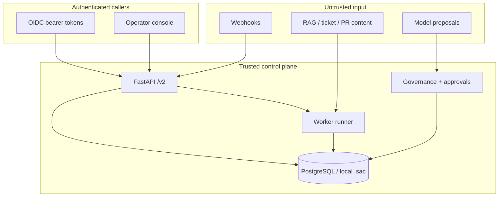

# Threat Model v2.5 — Enterprise Production Hardening

This document captures the security boundaries introduced in v2.1 through
v2.4 and the production-hardening controls added in v2.5. It supplements
`enterprise-docs/security-governance-plan.md` and
`enterprise-docs/platform-architecture-v2.md`.

## Scope

| Plane | v2.1–v2.4 boundary | v2.5 hardening |
|---|---|---|
| Service (`/v2` FastAPI) | OIDC bearer, tenant header, RBAC | Per-tenant RPM + inflight run caps |
| Workflow (worker) | PostgreSQL/file queue, run leases | DLQ for poison messages, bounded retries |
| Data (PostgreSQL + local `.sac`) | Tenant-scoped checkpoints, audit hash chain | Backup/restore scripts, schema migrations |
| Integration (GitHub, Jira) | Redacted connector I/O, webhook dedupe | Unchanged contract; secrets never in DLQ |
| Identity (OIDC) | JWT validation, tenant claim | Unchanged; rate limits are tenant-scoped |
| Observability | Redacted trace files, optional OTel | OTel behind config; DLQ errors redacted |

## Trust boundaries

## Assets

- Run checkpoints, approval grants, audit hash chain, evidence bundles.
- Connector credentials (GitHub App, Jira API token) in environment only.
- Retrieved knowledge chunks and long-term memory facts (tenant partitioned).

## Threats and mitigations

### T1 — Cross-tenant data access

- **Risk:** Subject or worker accesses another tenant's runs or audit events.
- **Mitigation:** `validate_tenant_id`, `assert_tenant_match` on persistence;
  API `X-Tenant-Id` enforcement; RBAC subject binding (v2.1).

### T2 — Poison queue messages stalling workers

- **Risk:** Malformed or unsupported commands block the worker loop.
- **Mitigation (v2.5.2):** Unsupported commands go directly to DLQ; transient
  failures retry up to `MAX_ATTEMPTS` (3); healthy jobs continue.

### T3 — Secret leakage via error paths

- **Risk:** Connector or model errors embed tokens into queue DLQ or logs.
- **Mitigation:** `redact_secrets` on DLQ payloads and API error surfaces;
  strict trace export profile unchanged.

### T4 — API abuse / cost runaway

- **Risk:** A tenant floods `/v2` or starts unbounded concurrent runs.
- **Mitigation (v2.5.3):** Token-bucket `rate_limit_rpm`; `max_inflight_runs`
  on run creation; `check_run_cost_budget` against `RunCosts`.

### T5 — Data loss on upgrade or incident

- **Risk:** Schema migration or operator error destroys audit/evidence.
- **Mitigation (v2.5.4):** Documented `enterprise-backup.sh` /
  `enterprise-restore.sh`; forward migrations under
  `persistence/postgres/migrations/`; restore verifies audit chain.

### T6 — Untrusted retrieval content as instructions

- **Risk (v2.4):** Ticket/PR/RAG text attempts prompt injection or policy bypass.
- **Mitigation:** Retrieval permission verdicts, citation identity, eval
  `prompt_injection` suite; model output remains non-authoritative.

### T7 — Approval grant replay

- **Risk:** Double consumption of GitHub write or MCP grants.
- **Mitigation:** Serializable grant consumption, single-use grants, hash-chain
  audit on decisions (v2.1 governance).

## GA Disposition Of v2.5 Yellow Risks

- Single-region operation is an explicit supported-scope boundary, not an
  unowned GA risk; multi-region HA remains a non-goal.
- The supported Compose profile runs one API process. Multi-process deployment
  is unsupported until a shared limiter is implemented.
- Connector key rotation is an operator prerequisite and must be demonstrated
  in the pending production deployment evidence before GA promotion.

## Verification

- Worker DLQ: `tests/enterprise/worker/test_dlq_offline.py`
- Rate limits and cost budgets: `tests/enterprise/perf/test_rate_limits.py`,
  `test_cost_budget_enforcement.py`
- Backup/restore: `tests/enterprise/persistence/test_backup_restore_offline.py`
- Load profile ratchet: `tests/enterprise/perf/test_load_profile_offline.py`
- Deploy contract: `tests/enterprise/deploy/test_compose_contract_offline.py`
