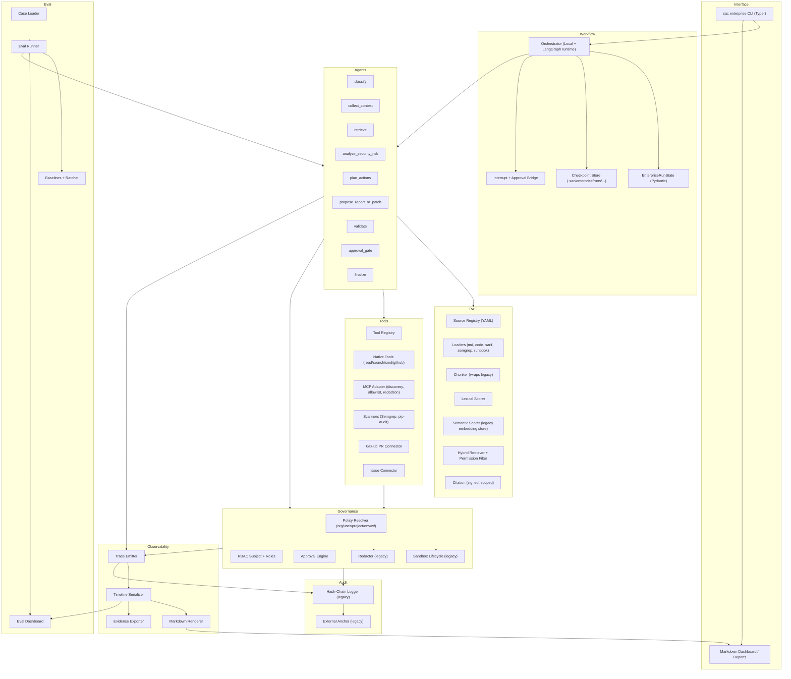
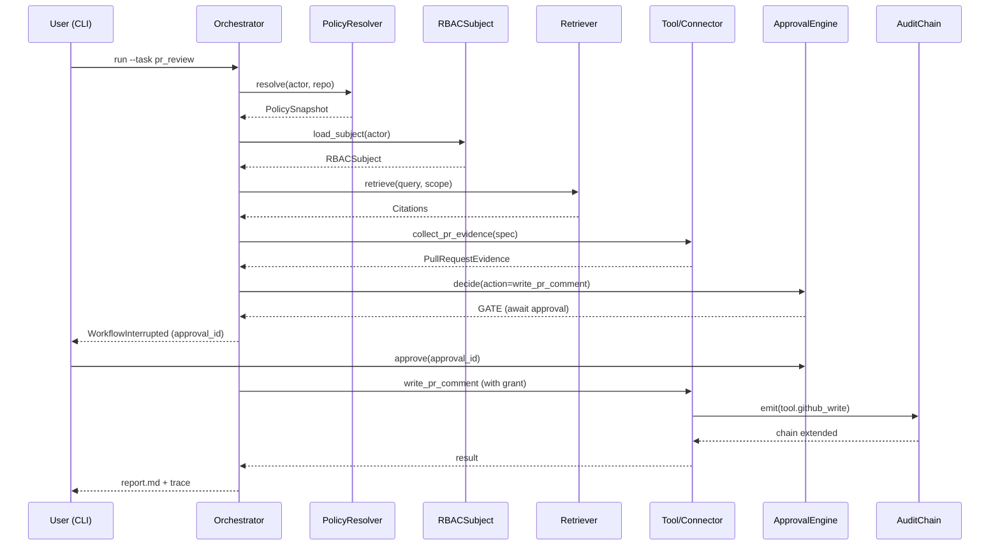

# System Architecture v1

This document captures the target architecture for the
`dev/enterprise-agent-platform` branch through the `v2.0` release
candidate. It is layered, with explicit data flow, control flow, and
trust boundaries.

The architecture is intentionally local-first. Every layer must work
on a developer laptop in MVP. Where a layer is designed to graduate
to a service later, the document calls out the graduation path.

---

## Diagram: Layered Target Architecture



The diagram intentionally avoids representing user data flow as a
single arrow. The interface initiates; everything else is event- or
patch-based with typed contracts.

---

## Diagram: Control Flow for a Single Run



---

## Diagram: Trust Boundaries

```mermaid
flowchart LR
  subgraph Trusted [Trusted Local Code]
    POL2["Policy Resolver"]
    RBAC2["RBAC"]
    APRE2["Approval Engine"]
    REG2["Tool Registry"]
    LOGGER["Audit Logger"]
  end

  subgraph SemiTrusted [Local Untrusted Inputs]
    PROJ["Project Policy File"]
    MEM["Approved Memory Facts"]
    MAN["Knowledge Source Manifest"]
  end

  subgraph Untrusted [Fully Untrusted Content]
    DOCS["Retrieved Docs"]
    PRC["PR Comments"]
    ISST["Ticket Text"]
    MCPO["MCP Tool Output"]
    SCANO["Scanner Output"]
    LLMO["LLM Output"]
  end

  Untrusted -. parsed as content .-> Trusted
  SemiTrusted -. validated by resolver .-> Trusted
  Trusted -- enforces --> SemiTrusted
  Trusted -- gates --> Untrusted
```



Rules:

- Trusted code never executes anything authored by untrusted content
  directly.
- LLM output is structured-parsed, then validated, then routed
  through trusted code.
- Semi-trusted inputs may *add* restrictions; they may not *remove*
  them.

---

## Layer Reference

### 1. Interface Layer

- **Surface:** Typer CLI (`sac enterprise ...`) backed by
  `src/safecode/cli_enterprise.py` (new in v1.1.3-T4).
- **Outputs:** Markdown reports, JSON timelines, evidence zips.
- **Reuse from legacy:** Typer app skeleton, Pydantic models, mock
  provider for tests.
- **What is new:** the `enterprise` Typer sub-app; the trace
  dashboard renderer (v1.5.3).
- **Graduation path:** Markdown dashboard → static HTML → web
  dashboard. The first two are local files; the third is a separate
  product stage and not promised before v2.0.

### 2. Workflow Layer

- **Components:** `EnterpriseRunState`, `LocalOrchestrator`,
  `LangGraph` adapter, checkpoint store, interrupt primitive.
- **Reuse:** orchestration patterns from `src/safecode/agent/` (loop,
  pending action, repair); reuse only the patterns, not the legacy
  agent loop.
- **What is new:** state shape, the orchestrator's
  graph-vs-local runtime swap, the checkpoint format.
- **Graduation path:** local file checkpoints → SQLite (v1.9.x
  optional) → server-backed checkpointer (v2.x or later, out of
  scope for the current roadmap).

### 3. Agent Layer (Nodes)

- **Components:** the nine workflow nodes plus task-specific
  sub-graphs (`pr_review`, `remediation`, `secure_planning`,
  `compliance_export`).
- **Reuse:** repair/validation patterns from
  `src/safecode/agent/repair.py` and
  `src/safecode/agent/validation.py`; provider clients from
  `src/safecode/llm/`.
- **What is new:** typed node-output schemas, conditional edges,
  reducer functions for the LangGraph runtime.
- **Multi-agent discipline:** roles
  (`SecurityAnalyzer`, `PolicyReviewer`, `CodeFixer`, `Validator`,
  `Reporter`) are *not* separate processes; they are typed prompt +
  schema bundles each owned by a node. Adding a new role requires a
  new typed output schema; "we should have more agents" is not a
  valid justification.

### 4. RAG Layer

- **Components:** source registry, loaders, chunker, scorers,
  hybrid retriever, citation packing.
- **Reuse:** `src/safecode/context/budget.py` (budget packer),
  `src/safecode/context/redactor.py`, `src/safecode/context/selector.py`,
  `src/safecode/context/hybrid_retrieval.py` (patterns, not
  rewrapped), `src/safecode/index/chunker.py`,
  `src/safecode/index/embedding_backend.py`,
  `src/safecode/index/embedding_store.py`.
- **What is new:** permission-aware filter, source-typed metadata
  schema, deterministic chunk-id stability, citation object.
- **Graduation path:** in-process embedding store → SQLite-backed
  vector store (v1.9.x optional) → external vector DB connector
  (later, behind an extras feature flag).

### 5. Tool / MCP Layer

- **Components:** `ToolRegistry`, native tool wrappers, MCP adapter,
  scanner connectors, GitHub PR connector, issue connector.
- **Reuse:** `src/safecode/agent/native_tools.py`,
  `src/safecode/agent/github_read_tools.py`,
  `src/safecode/agent/github_write_tools.py`,
  `src/safecode/agent/command_tool.py`, `src/safecode/mcp/`,
  `src/safecode/sandbox/`.
- **What is new:** registry-level enterprise approval tier, a
  policy-driven allowlist for MCP tools, typed evidence models per
  connector, scanner-output normalizers.
- **Graduation path:** local execution and offline fixtures → live
  GitHub/Jira/Linear (gated by network policy) → in-cluster MCP
  servers.

### 6. Governance Layer

- **Components:** policy resolver, RBAC, approval engine, sandbox
  lifecycle, redactor.
- **Reuse:** `src/safecode/policy/`, `src/safecode/sandbox/`,
  `src/safecode/audit/`, `src/safecode/context/redactor.py`,
  `src/safecode/agent/approvals.py`,
  `src/safecode/agent/pending_action.py`.
- **What is new:** the org/user/project/env/workflow precedence
  chain, the RBAC subject and role-to-action matrix, the approval
  engine and grant store with single-use semantics, audit event
  taxonomy specific to enterprise workflows.
- **Graduation path:** local YAML files → org policy distribution
  via Git (read-only) → centralized policy service (later).

### 7. Observability Layer

- **Components:** trace emitter, timeline serializer, Markdown
  renderer, evidence exporter.
- **Reuse:** `src/safecode/trace/` patterns and any existing
  structured logger.
- **What is new:** trace event taxonomy, run-timeline schema,
  Markdown dashboard, evidence exporter.
- **Graduation path:** Markdown dashboard → static HTML site →
  OpenTelemetry exporter to an external store. OTel is *not*
  required before v2.x.

### 8. Evaluation Layer

- **Components:** case loader, runner, baselines, dashboard.
- **Reuse:** `src/safecode/eval/` patterns; `tests/test_*` style
  for deterministic suites.
- **What is new:** the enterprise case schema, the prompt-injection
  and tool-classification adversarial suites, the workflow-level
  baselines.
- **Graduation path:** pytest-driven runner → CLI runner with
  parallel execution → CI-integrated regression gate.

### 9. Audit Layer

- **Components:** legacy hash-chain logger and external anchor.
- **Reuse:** `src/safecode/audit/logger.py`,
  `src/safecode/audit/anchor.py`, `src/safecode/audit/models.py`.
- **What is new:** enterprise event types are encoded as Pydantic
  classes in `src/safecode/enterprise/audit/events.py` and emitted
  through the legacy logger.
- **Graduation path:** local hash-chain → signed anchors in shared
  storage → external transparency log (out of scope before v2.x).

---

## Reuse Map: Legacy → Enterprise

| Legacy module | Enterprise consumer | Reuse style |
|---------------|---------------------|-------------|
| `src/safecode/llm/` | Workflow nodes calling LLM | Direct (provider factory) |
| `src/safecode/index/chunker.py` | RAG chunker (v1.1.2) | Delegation (wrapped, not modified) |
| `src/safecode/index/embedding_backend.py` | RAG semantic scorer (v1.1.3) | Direct |
| `src/safecode/index/embedding_store.py` | RAG semantic store | Direct |
| `src/safecode/context/budget.py` | Workflow context packing | Direct |
| `src/safecode/context/redactor.py` | Retrieval and trace redaction | Direct |
| `src/safecode/context/selector.py` | Selection-reason structure | Pattern reuse |
| `src/safecode/context/hybrid_retrieval.py` | Hybrid retriever interface | Pattern reuse |
| `src/safecode/agent/native_tools.py` | Tool registry spec source | Read-only |
| `src/safecode/agent/github_read_tools.py` | GitHub PR connector | Direct (no modification) |
| `src/safecode/agent/github_write_tools.py` | PR comment writer | Direct via approval engine |
| `src/safecode/agent/command_tool.py` | Sandbox-gated commands | Direct |
| `src/safecode/agent/repair.py` | Node repair pattern | Pattern reuse |
| `src/safecode/agent/validation.py` | Node validation pattern | Pattern reuse |
| `src/safecode/mcp/discovery.py` | MCP adapter | Direct |
| `src/safecode/mcp/runner.py` | MCP execution | Direct |
| `src/safecode/mcp/proposal.py` | MCP write proposal | Direct |
| `src/safecode/mcp/approval_grant.py` | MCP single-use grant | Direct |
| `src/safecode/sandbox/*` | Scanner and command execution | Direct |
| `src/safecode/audit/logger.py` | Workflow audit chain | Direct |
| `src/safecode/audit/anchor.py` | Audit anchors | Direct |
| `src/safecode/policy/` | Policy resolver (extends) | Composition |
| `src/safecode/memory/` | Memory injection (approved facts) | Direct |
| `src/safecode/eval/` | Eval runner skeleton | Pattern reuse |

"Direct" means the enterprise module imports the legacy module and
does not redefine its API. "Pattern reuse" means we keep the same
mental model but build a new module under `src/safecode/enterprise/`
so the legacy code is not modified.

---

## Data Flow

### Inbound

1. CLI parses arguments into a typed `RunRequest`.
2. Orchestrator resolves the `PolicySnapshot` and `RBACSubject`.
3. Orchestrator constructs `EnterpriseRunState` and routes to the
   task-specific sub-graph.
4. Each node returns a `NodePatch` containing typed sub-state and
   draft trace events.

### Outbound

1. Orchestrator applies patches; emits events via the trace emitter.
2. Approval requests are written to the request store; the
   orchestrator raises `WorkflowInterrupted` if any are pending.
3. On completion, the orchestrator renders the report and writes the
   timeline.
4. Evidence export gathers state, timeline, citations, approvals,
   audit chain, and validation results.

### Persistence Layout

```
.sac/enterprise/
  runs/
    <run_id>/
      state.json
      node_<n>_<name>.json
      trace.jsonl
      timeline.json
      report.md
      approvals/
        <approval_id>.json
      grants/
        <grant_id>.json
  approvals/
    pending_index.json
  policy/
    snapshot_<id>.json
  eval/
    latest.md
    history/<commit>.md
```

---

## Control Flow Rules

- The orchestrator is the only component that mutates
  `EnterpriseRunState`.
- Nodes return *patches*; they do not mutate state in place.
- No node calls a tool directly. Tools are obtained from the
  registry and invoked through the approval engine.
- The approval engine is the only place that returns
  `ApprovalDecision`; nodes never decide on their own.
- The audit logger is the only place that closes a hash-chain
  link; the trace emitter is the only place that closes a trace
  event. Both can be called from any node; both refuse double-emit
  for the same `event_id`.

---

## Security Boundaries

| Boundary | Rule | Enforcement |
|----------|------|-------------|
| Model output → execution | Model output is never execution authority. | Approval engine + tool registry + structured validation. |
| Retrieved content → instructions | Content is parsed as data, not instructions. | Prompt-injection eval (v1.6.3) + retriever returning content tagged with `permission_verdict`. |
| Project config → policy | Project config cannot weaken org/user. | Resolver no-weakening rule (v1.4.1). |
| MCP server → classification | Server-claimed `category` ignored. | MCP adapter allowlist (v1.3.5). |
| Run A → run B | Tenant isolation in RAG and audit. | `tenant_id` on subject, snapshot, indexes (v1.9.1). |
| Trace export → external sharing | Strict redaction by default. | Redactor + debug-mode policy bit (v1.5.4). |
| Sandbox → host | Existing legacy gates (proposal/preflight/approval/execute). | Legacy `src/safecode/sandbox/`. |
| Write tool → file system | Checkpoint and rollback mandatory. | Legacy patch + checkpoint, plus enterprise approval engine. |

---

## Deployment Profiles

| Profile | Components | Storage | Trust | Where it works today |
|---------|------------|---------|-------|----------------------|
| Local Single-User | All MVP modules | Local filesystem + JSON | Single trusted operator | v1.0 → v1.9 |
| Team Server | Same MVP modules; multi-tenant via `tenant_id` | Local filesystem or shared volume | Shared mount; per-tenant indexes | v1.9.1+ |
| On-Prem Hybrid (Planned) | Same modules; remote anchors, optional vector DB | External vector DB and anchor service | Operator-controlled secrets | Plan only; first real components at v2.0.3 |

No profile beyond Local Single-User requires components that do not
exist today. The architecture is the same; the binding to storage
and identity changes.

---

## Architectural Decisions Captured Here

These decisions are normative and override conflicting prose in
other files unless they are updated in `decision-log.md`.

1. **Local-first MVP.** All MVP behavior must run on a developer
   laptop with `uv sync` and the mock LLM provider.
2. **LangGraph optional.** LangGraph is an optional dependency
   behind an extras flag; the local orchestrator is the
   deterministic test default.
3. **Reuse the legacy safety kernel.** No new safety primitive may
   bypass or replicate the legacy primitives (`policy`, `audit`,
   `sandbox`, `redactor`, `checkpoint`).
4. **Patches, not mutations.** Workflow nodes return patches; the
   orchestrator applies them.
5. **One registry per surface.** `ToolRegistry` is the single
   surface for tool execution decisions; `SourceRegistry` is the
   single surface for retrieval. No direct calls.
6. **Strict redaction by default.** Trace export, evidence export,
   and eval bundles redact by default; relaxing requires explicit
   policy.
7. **No hosted dependency before v2.x.** Optional dependencies are
   allowed via extras; no required hosted service.

---

## Extension Points Reserved for Later

The architecture leaves space for the following extensions but
does not depend on them before v2.0:

- Web dashboard (replaces Markdown renderer at the output stage).
- OpenTelemetry exporter (parallel to file emitter).
- External vector DB connector (behind `SemanticScorer` interface).
- External policy distribution (behind `PolicyResolver` source
  loader).
- SSO/LDAP identity (behind `RBACSubject` loader).

Each is a *swap* at a single interface; none require redesigning
the core layers.
