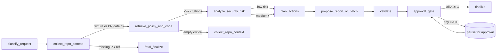
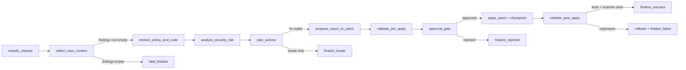

# Workflow Design

**Implementation status:** PR review, remediation, and secure planning are
implemented. Compliance evidence uses the standalone export command; the
`compliance_export` workflow task remains fail-closed.
This document specifies the four enterprise workflows. Each workflow
is a sub-graph over the nine canonical nodes described below. The sub-graphs share infrastructure but
differ in inputs, conditional edges, and outputs.

Conventions:

- **Inputs / Outputs** are typed by the models in `data-models.md`.
- **Nodes** are the canonical nine; a workflow may skip a node by
  emitting a `skipped` `NodeOutput`.
- **LLM nodes** are explicitly tagged; everything else is
  deterministic code. The mock provider must be sufficient for unit
  tests.
- **HITL** points are tied to `ApprovalRequest` rows. The CLI must
  surface a clear message when a workflow pauses.
- **Tests** is the path or pattern of pytest files that cover the
  workflow.

---

## Canonical Nodes (shared by all workflows)

| Node | Kind | Purpose |
|------|------|---------|
| `classify_request` | Deterministic | Maps `RunRequest` to a `TaskType` and a sub-graph reference. |
| `collect_repo_context` | Tool-driven | Gathers repo metadata, calls connectors (PR, issue, scanner) for typed evidence. |
| `retrieve_policy_and_code` | RAG | Runs the hybrid retriever against the actor's permission scope. |
| `analyze_security_risk` | LLM | Produces a typed `RiskAssessment` from evidence; validated against schema. |
| `plan_actions` | LLM | Produces a typed `Plan` with risk-ranked actions and required approvals. |
| `propose_report_or_patch` | LLM | Produces typed `Proposal` items (report, diff, comment, ticket). |
| `validate` | Tool-driven | Runs tests / scanners / config checks; records outcomes. |
| `approval_gate` | Deterministic | Evaluates each proposal against the approval engine; raises `WorkflowInterrupted` for `GATE`/`BLOCK`. |
| `finalize` | Deterministic | Writes the `Report`, the timeline, and emits the closing audit event. |

LLM nodes always require structured output. A structured-output
validation failure triggers one repair attempt; a second failure is
recorded as a `FailureRecord` and the run transitions to `failed`.

---

## Workflow 1 — PR Security Review

### Goal

Given a pull request (live or fixture), produce a risk-ranked report
with citations, optionally draft a PR comment, and gate any actual
PR comment posting behind approval.

### Inputs

- `RunRequest.task_type = pr_review`.
- `RunRequest.input_kind ∈ {pr_fixture, pr_live}`.
- `RunRequest.input_ref` is a path to a fixture JSON or a
  `owner/repo#number` ref.

### Outputs

- `Report.kind = pr_review_report` Markdown.
- Optional `Proposal.kind = pr_comment_draft` (always written to a
  local file); live posting requires explicit approval.
- Timeline + trace events.

### LangGraph state fields used

- All `EnterpriseRunState` fields above.
- `PullRequestEvidence` attached at `collect_repo_context`.
- `RiskAssessment` (sub-model on `analyze_security_risk` output).
- `Plan` items per finding.
- `Proposal` items per finding.

### Node graph



### Conditional edges

- **collect_repo_context → retrieve_policy_and_code:** edge fires
  when `PullRequestEvidence` has at least one hunk.
- **retrieve_policy_and_code → analyze_security_risk:** fires when
  the citation set is non-empty OR the actor has a `bypass_empty`
  scope. Otherwise the workflow loops back once to widen the query;
  a second empty result yields a `FailureRecord` and proceeds with
  zero-citation analysis (still allowed; reported as `low confidence`).
- **analyze_security_risk → plan_actions:** unconditional.
- **propose_report_or_patch → validate:** unconditional.
- **validate → approval_gate:** unconditional.
- **approval_gate → WAIT:** when any proposal requires `GATE` and
  the engine returns no grant.
- **approval_gate → finalize:** when all proposals have either AUTO
  decisions or consumed grants.

### Tool calls

- `github_pr.fetch_pr` (offline by default).
- `hybrid_retriever.retrieve` (RAG).
- `github_pr_write.post_comment` (only when `pr_live`, approved, and
  network policy permits).
- `command` (validate node only; e.g. lint checks). Sandbox-gated.

### RAG retrieval points

- `retrieve_policy_and_code` runs three queries seeded from the
  diff: (1) per-file vulnerability hints, (2) per-symbol/identifier,
  (3) per-language secure coding standard. Caps at
  `RAG_MAX_CITATIONS` per query.

### Human-in-the-loop points

- `approval_gate` always pauses for `pr_comment_post` when
  `pr_live`.
- `approval_gate` pauses for any `Plan` action with `risk_tier ≥ high`
  regardless of mode.

### Failure / retry strategy

- Structured-output schema fail on LLM nodes → 1 repair attempt with
  the validator's reason fed back; second failure → `failed`.
- Connector network error → mark `tool_call_record.outcome=error`;
  workflow continues with empty evidence and lower confidence.
- `validate` failures do not block the report; they downgrade the
  draft comment proposal to "needs human attention".
- Approval reject → workflow finalizes with `rejected` and writes a
  decision-log entry; never re-attempts the same action.

### Tests

- `tests/enterprise/workflow/tasks/test_pr_review_happy_path.py`
- `tests/enterprise/workflow/tasks/test_pr_review_no_findings.py`
- `tests/enterprise/workflow/tasks/test_pr_review_approval_gate.py`
- `tests/enterprise/eval/cases/pr_review/*.yaml` (v1.6.4 + v1.7.4)

### Demo flow

```text
$ sac enterprise workflow run \
    --task pr_review \
    --input examples/enterprise/fixtures/pr_sql_injection/

[trace] run-01HX... classify_request -> task=pr_review
[trace] collect_repo_context -> 4 files, 2 hunks, evidence-id PR-001
[trace] retrieve_policy_and_code -> 3 citations
[trace] analyze_security_risk -> risk=high (sql_injection)
[trace] plan_actions -> 2 actions: pr_comment_draft (AUTO), pr_comment_post (GATE)
[trace] propose_report_or_patch -> draft report, draft comment
[trace] validate -> tests not run (report-only)
[trace] approval_gate -> awaiting approval approval-01HX...

$ sac enterprise approval show approval-01HX...
Action: pr_comment_post
Risk tier: high
Policy snapshot: pol-01HX...
Preview:
> **Possible SQL injection** in src/db/users.py:42 ...

$ sac enterprise approval approve approval-01HX... --note "verified by AppSec"

$ sac enterprise workflow run --resume run-01HX...
[trace] approval_gate -> grant consumed
[trace] propose: pr_comment_post executed via github_pr_write
[trace] finalize -> report.md, timeline.json
```

---

## Workflow 2 — Vulnerability Remediation

### Goal

Given a security finding (SAST output, Semgrep result, or manual
ticket), locate the vulnerable code, propose a minimal patch,
checkpoint the file system, await approval, apply the patch,
re-validate, and either commit or rollback.

### Inputs

- `RunRequest.task_type = remediation`.
- `RunRequest.input_kind ∈ {finding_fixture, finding_live}`.
- `RunRequest.input_ref` is a SARIF or Semgrep JSON path (offline)
  or a connector reference (live).

### Outputs

- `Report.kind = remediation_report`.
- Optional `Proposal.kind = patch_diff` with apply state.
- A re-validated test/scanner result.

### LangGraph state fields used

- All canonical fields.
- `SecurityFinding` set from `collect_repo_context`.
- `Plan` with two streams: locate-only and locate+fix.
- `Proposal` includes a patch + rollback handle.

### Node graph



The orchestrator implements `apply_patch + checkpoint`,
`validate_post_apply`, and `rollback` as helper nodes added to the
`remediation` sub-graph (not part of the canonical nine).

### Conditional edges

- **plan_actions → propose_report_or_patch:** when at least one
  finding has `confidence ≥ medium` and a fix is bounded to ≤ 5
  files (configurable cap).
- **plan_actions → finalize_locate:** when no fix is viable; report
  contains location and remediation guidance only.
- **validate_pre_apply → approval_gate:** unconditional.
- **approval_gate → apply_patch:** when grant consumed.
- **validate_post_apply → finalize_success:** when validation passes
  and scanner re-run shows the finding cleared.
- **validate_post_apply → rollback:** when validation introduces new
  failures or the scanner finds new issues.

### Tool calls

- Scanner connectors (`semgrep`, `pip_audit`) via the sandbox
  proposal pipeline.
- Native `read_file`, `search`, and patch tools from the legacy
  agent surface, wrapped by the enterprise tool registry.
- Checkpoint + rollback via `src/safecode/checkpoint/`.

### RAG retrieval points

- `retrieve_policy_and_code` runs per-finding queries seeded by
  CWE id, rule id, file path, and symbol.
- For each finding: at least one expected citation is a policy doc
  and at least one is a code chunk (eval suite enforces this).

### Human-in-the-loop points

- `approval_gate` pauses for every patch apply (`file_write`).
- Re-approval is *not* automatic after a rollback; a new request is
  generated so the human can see what changed.

### Failure / retry strategy

- LLM schema fail → one repair.
- Scanner schema fail → typed `UnsupportedScannerVersionError`; the
  finding is dropped with an audit event.
- Validate failure post-apply → automatic rollback; never retries
  the same patch.
- Approval rejected → finalize with `rejected`; preserve the
  proposed patch in the report for human follow-up.

### Tests

- `tests/enterprise/workflow/tasks/test_remediation_ingest.py`
- `tests/enterprise/workflow/tasks/test_remediation_classifier.py`
- `tests/enterprise/workflow/test_patch_rollback.py`
- `tests/enterprise/workflow/test_validation_rerun.py`
- `tests/enterprise/eval/cases/remediation/*.yaml`

### Demo flow

```text
$ sac enterprise workflow run \
    --task remediation \
    --input examples/enterprise/fixtures/semgrep_sql_injection.json

[trace] collect_repo_context -> 1 finding, semgrep:python.lang.security.sql-injection
[trace] retrieve_policy_and_code -> 2 citations (policy + code)
[trace] analyze_security_risk -> risk=high
[trace] plan_actions -> 1 action: fix_patch
[trace] propose_report_or_patch -> diff (3 lines changed)
[trace] validate_pre_apply -> tests pass on current tree
[trace] approval_gate -> awaiting approval approval-...

$ sac enterprise approval approve approval-... --note "minimal fix"

$ sac enterprise workflow run --resume run-...
[trace] checkpoint -> chk-...
[trace] apply_patch -> 1 file modified
[trace] validate_post_apply -> tests pass; scanner re-run: finding cleared
[trace] finalize_success -> report.md
```

---

## Workflow 3 — Secure Implementation Planning

### Goal

Given a Jira/Linear ticket or product requirement, produce a threat-
aware implementation plan that lists affected files, suggested code
changes, required tests, threat-modeling notes, and required
approvals. No code changes are applied; the workflow ends with a
plan and a draft ticket update.

### Inputs

- `RunRequest.task_type = secure_planning`.
- `RunRequest.input_kind = ticket`.
- `RunRequest.input_ref` is a path to a Markdown ticket or a Jira
  JSON payload.

### Outputs

- `Report.kind = implementation_plan`.
- Optional `Proposal.kind = ticket_comment_draft` (always written to
  a local file; live update gated by approval).

### LangGraph state fields used

- `IssueEvidence` attached at `collect_repo_context`.
- `Citation` set focusing on architecture docs, secure coding
  standards, and existing similar code.
- `Plan` items: high-level steps with file pointers and tests.

### Node graph

```mermaid
flowchart LR
  P0[classify_request] --> P1[collect_repo_context]
  P1 --> P2[retrieve_policy_and_code]
  P2 --> P3[analyze_security_risk]
  P3 --> P4[plan_actions]
  P4 --> P5[propose_report_or_patch]
  P5 --> P6[approval_gate]
  P6 -->|all AUTO| P7[finalize]
  P6 -->|GATE (ticket post)| WAIT[(await approval)]
  WAIT --> P6
```

The `validate` node is skipped: this workflow does not run tests or
scanners. A `NodeOutput` records the skip with an explicit reason.

### Conditional edges

- **plan_actions → propose_report_or_patch:** unconditional.
- **approval_gate → WAIT:** if the actor requested
  `--post-to-ticket` and the action requires `GATE`.

### Tool calls

- Issue connector (`issue.fetch_issue`).
- Hybrid retriever for architecture and policy.
- Optional ticket-post connector (offline by default).

### RAG retrieval points

- Two query rounds: (1) seeded by ticket title and labels, (2)
  seeded by extracted entities (component names, language, data
  classification keywords).

### Human-in-the-loop points

- Only for posting a draft back to the ticket. Plan generation is
  AUTO.

### Failure / retry strategy

- Same LLM schema repair as the others.
- Connector error (Jira JSON malformed) → typed error; workflow
  finalizes with `failed`.

### Tests

- `tests/enterprise/workflow/test_secure_planning_offline.py`
- There is no dedicated secure-planning baseline suite; deterministic workflow
  tests own the current contract.

### Demo flow

```text
$ sac enterprise workflow run \
    --task secure_planning \
    --input examples/enterprise/fixtures/ticket_password_reset/ticket.md

[trace] collect_repo_context -> IssueEvidence id=TICKET-42
[trace] retrieve_policy_and_code -> 4 citations (3 policy + 1 code)
[trace] analyze_security_risk -> risk=medium (token leakage if email reuse)
[trace] plan_actions -> 5 steps with file pointers
[trace] propose_report_or_patch -> plan.md + draft ticket comment
[trace] approval_gate -> all AUTO (plan-only)
[trace] finalize -> report.md
```

---

## Workflow 4 — Compliance Evidence Export

`TaskType.compliance_export` is reserved but intentionally rejected at workflow
initialization. Evidence export is a standalone, read-only operation over one
completed run:

```bash
sac enterprise evidence export --run <run_id> --tenant <tenant_id> --root .
```

The exporter:

1. validates the run and tenant binding;
2. verifies the source audit chain;
3. applies strict redaction to state, trace, approvals, citations, validation,
   and report content;
4. writes a zip bundle with per-file SHA-256 hashes;
5. preserves a verifiable audit segment without rewriting hashed events.

Missing runs, tenant mismatches, chain corruption, or content that would require
post-hash audit redaction fail closed. The maintained contract lives in
`tests/enterprise/evidence/test_export_shape.py` and related evidence tests.

---

## Cross-Workflow Concerns

### Determinism vs LLM nodes

| Node | PR review | Remediation | Secure planning | Compliance export |
|------|-----------|-------------|-----------------|-------------------|
| `classify_request` | det | det | det | det |
| `collect_repo_context` | tool | tool | tool | det (file read) |
| `retrieve_policy_and_code` | RAG | RAG | RAG | RAG (snapshot lookup) |
| `analyze_security_risk` | LLM | LLM | LLM | det (invariant check) |
| `plan_actions` | LLM | LLM | LLM | det (manifest) |
| `propose_report_or_patch` | LLM | LLM | LLM | det (renderer) |
| `validate` | tool | tool | skipped | det (hash check) |
| `approval_gate` | det | det | det | det |
| `finalize` | det | det | det | det |

LLM nodes always validate output against a Pydantic schema. The
mock provider returns canned outputs for fixtures.

### Resume behavior

Every workflow supports `--resume <run_id>`. The orchestrator:

1. Loads the latest state checkpoint.
2. Computes the next node from `node_outputs`.
3. If a pending approval exists, checks for a decision; if absent,
   prints the pending list and exits.
4. Continues from the next node.

A run that has been finalized refuses to resume.

### Failure taxonomy mapping

| Workflow | Common failures and where they appear |
|----------|----------------------------------------|
| PR review | `retrieval_empty`, `model_validation`, `tool_blocked` (write), `approval_rejected` |
| Remediation | `tool_error` (scanner schema), `validation_failed` (post-apply), `approval_rejected`, `model_validation` |
| Secure planning | `model_validation`, `retrieval_empty` |
| Compliance export | `unknown_run`, `chain_mismatch`, `policy_block` (debug bundle) |

### Workflow → eval suite mapping

| Workflow | Maintained coverage |
|----------|---------------------|
| PR review | `pr_review` eval suite + workflow tests |
| Remediation | `remediation` eval suite + workflow tests |
| Secure planning | Deterministic workflow tests |
| Compliance export | Evidence export and integrity tests |

### Workflow → approval action map

| Workflow | Actions that may need GATE |
|----------|---------------------------|
| PR review | `github_write_comment` (live mode), `github_pr_create` |
| Remediation | `file_write` (patch apply), `command_execute` (validation if `high` risk), `scanner_run` (if production-like) |
| Secure planning | `issue_comment` (ticket post) |
| Compliance export | `production_access` (if a debug bundle including secrets is requested) |

---

## Design Rules That Apply To Every Workflow

These rules are enforced in code and tests. Violations are bugs.

1. The orchestrator is the only mutator of `EnterpriseRunState`.
2. Every node returns a `NodePatch`; the orchestrator validates
   `state_updates` before applying.
3. LLM-node outputs are always parsed into Pydantic models before
   being treated as data.
4. Retrieved content is never treated as instruction; prompt-
   injection eval cases enforce this.
5. Every external call (network, file, command) emits a
   `tool_call_record` and an audit event.
6. Approval requests reference a `policy_snapshot_id`. Resuming a
   workflow with a different snapshot id requires a new request.
7. No workflow may finalize as `succeeded` without a non-empty
   report and a passing safety invariant check.
8. Re-running a workflow with the same `run_id` is rejected; the
   CLI generates a new id by default.
